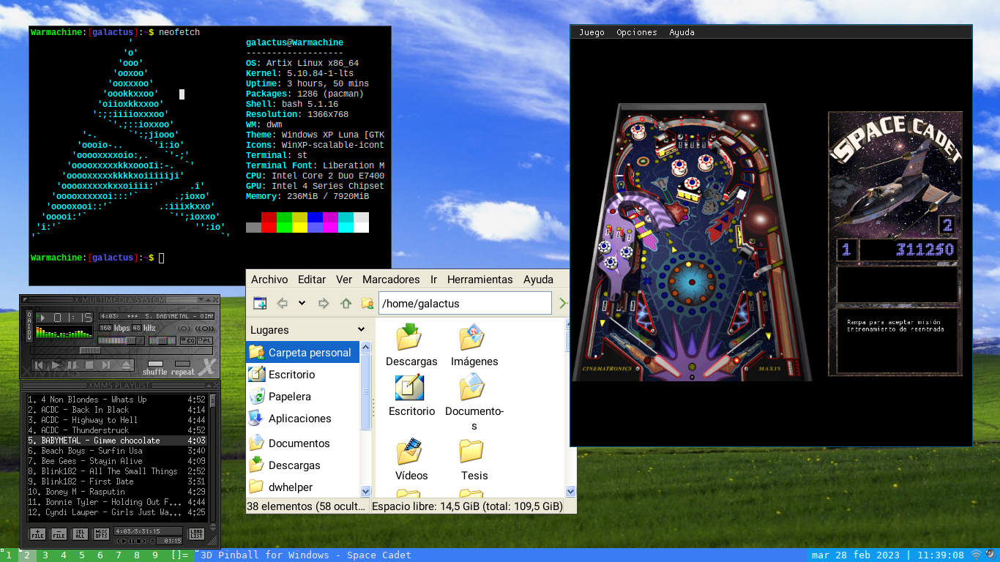

# dwmxp
Suckless DWM (Dinamic Windows Manager) with Windows XP theme

Installation
------------
    cp config.def.h config.h
    sudo make clean install
    
Configuration
-------------
Create autostart script
    mkdir ~/.dwm/
    echo "#!/bin/bash" > ~/.dwm/autostart.sh
    sudo chmod +x ~/.dwm/autostart.sh

Edit ~/.dwm/autostart.sh and add your favorite applications, for example:
    #!/bin/sh
    start-pulseaudio-x11 &
	setxkbmap es &
	nitrogen --restore &
	volumeicon &
	cmst -m &

Running dwm
-----------
Add the following line to your .xinitrc to start dwm using startx:
    exec dwm
    
Extra
-----
Wallpaper: bliss.jpg
Theme: https://www.gnome-look.org/p/1230964/
icons: https://www.gnome-look.org/p/1925937
